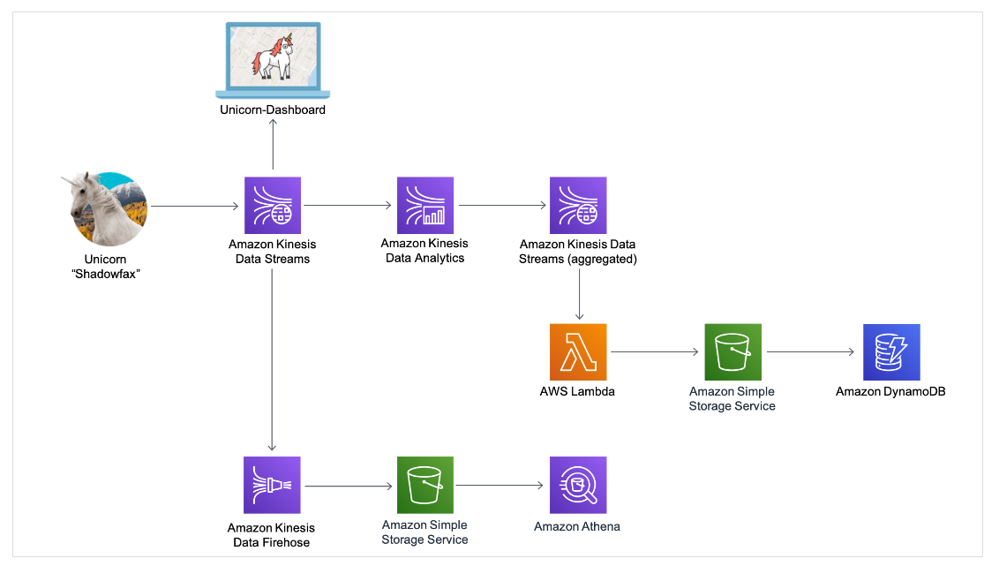

# Build a Serverless Real-Time Data Processing App

with AWS Lambda, Amazon Kinesis, Amazon S3, Amazon DynamoDB, Amazon Cognito, and Amazon Athena

Overview
Serverless applications don’t require you to provision, scale, and manage any servers. You can build them for nearly any type of application or backend service, and everything required to run and scale your application with high availability is handled for you.

Serverless architectures can be used for many types of applications. For example, you can process transaction orders, analyze click streams, clean data, generate metrics, filter logs, analyze social media, or perform IoT device data telemetry and metering.

In this project, you’ll learn how to build a serverless app to process real-time data streams. You’ll build infrastructure for a fictional ride-sharing company. In this case, you will enable operations personnel at a fictional Wild Rydes headquarters to monitor the health and status of their unicorn fleet. Each unicorn is equipped with a sensor that reports its location and vital signs.

You’ll use AWS to build applications to process and visualize this data in real-time. You’ll use AWS Lambda to process real-time streams, Amazon DynamoDB to persist records in a NoSQL database, Amazon Kinesis Data Analytics to aggregate data, Amazon Kinesis Data Firehose to archive the raw data to Amazon S3, and Amazon Athena to run ad-hoc queries against the raw data.

This workshop is broken up into four modules. You must complete each module before proceeding to the next.

* Build a data stream
   Create a stream in Kinesis and write to and read from the stream to track
   Wild Rydes unicorns on the live map. In this module you'll also create an
   Amazon Cognito identity pool to grant live map access to your stream.

* Aggregate data
   Build a Kinesis Data Analytics application to read from the stream and
   aggregate metrics like unicorn health and distance traveled each minute.

* Process streaming data
   Persist aggregate data from the application to a backend database stored
   in DynamoDB and run queries against those data.

* Store & query data
   Use Kinesis Data Firehose to flush the raw sensor data to an S3 bucket
   for archival purposes. Using Athena, you'll run SQL queries against the
   raw data for ad-hoc analyses.

## Application Architecture

## Further Work

Here’s a list of other things to try if you have spare time to continue tinkering with the unicorn monitoring system:

Write a consumer for the wildrydes stream in the programming language of your choice using the AWS SDKs. Experiment with the output format.
Build an Amazon Kinesis Data Analytics application which reads from the wildrydes stream and selects data points where any of the unicorns' vital signs is below 100 points.
Create an AWS Lambda function to read from the stream and send proactive alerts to operations personnel when any of the unicorns' vital signs is below 100 points.
Write additional Amazon Athena queries. Find:

- Select all latitude and longitude pairs reported by a unicorn on a trip.
- All data points captured after a specific timestamp
- The total all-time distance traveled by each unicorn.
- All data points where a unicorns' vitals were below 100 points.